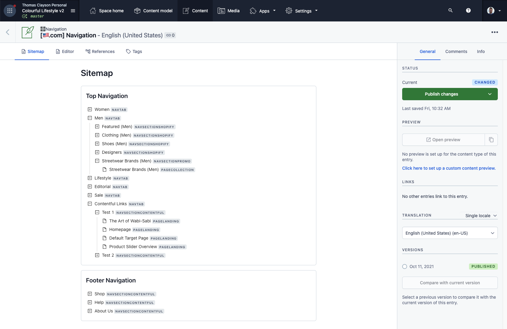
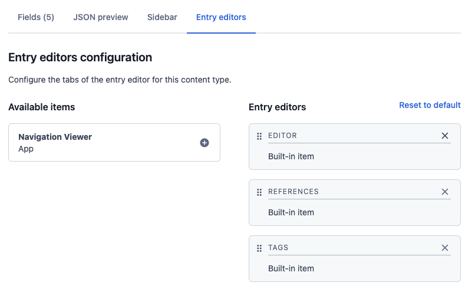

# Navigation Viewer for Contentful Lifestyle Demo Environment

An Entry Editor tab that shows an expanding tree view of your navigation menus within Contentful in Colorful Lifestyle (v2) demo environments. It uses the `🎛 Navigation` component as a starting point and the tree view can be expanded to see each layer of the navigation structures that you set up in the demo. This app uses lazy loading for performance and to reduce API calls.

## Install the App

Use the following button to install the app in your space!

## Setup (in space)

The app functions as an Entry Editor tab, so to complete the setup please navigate to your Content Model, find the `🎛 Navigation` content type and click into it. 

From here navigate to the "Entry Editors" tab and click the plus (+) next to the Navigation Viewer entry editor.

The Navigation Viewer app is now installed and ready to be demoed by navigating to the Content page, selecting any `🎛 Navigation` content entry and switching to the Navigation Viewer tab (see screenshot above).

## Troubleshooting

This app is an internal project for use with the Colorful Lifestyle v2 demo environment. It uses hard coded values to traverse the navigation tree. If the Lifestyle demo's navigation content types are ever updated this app may stop working.

This app is intended for internal use only and does not represent production-ready code.

If you are an SE and you are having trouble installing this app please contact Thomas Clayson, or raise an issue here.

## Want to contribute?

Please feel free to contribute code and pull requests to this app.

This project was bootstrapped with [Create Contentful App](https://github.com/contentful/create-contentful-app).

### Available Scripts

In the project directory, you can run:

#### `npm start`

Creates or updates your app definition in Contentful, and runs the app in development mode.
Open your app to view it in the browser.

The page will reload if you make edits.
You will also see any lint errors in the console.

#### `npm run build`

Builds the app for production to the `build` folder.
It correctly bundles React in production mode and optimizes the build for the best performance.

The build is minified and the filenames include the hashes.
Your app is ready to be deployed!

#### `npm run upload`

Uploads the build folder to contentful and creates a bundle that is automatically activated.
The command guides you through the deployment process and asks for all required arguments.
Read [here](https://www.contentful.com/developers/docs/extensibility/app-framework/create-contentful-app/#deploy-with-contentful) for more information about the deployment process.

#### `npm run upload-ci`

Similar to `npm run upload` it will upload your app to contentful and activate it. The only difference is   
that with this command all required arguments are read from the environment variables, for example when you add
the upload command to your CI pipeline.

For this command to work, the following environment variables must be set: 

- `CONTENTFUL_ORG_ID` - The ID of your organization
- `CONTENTFUL_APP_DEF_ID` - The ID of the app to which to add the bundle
- `CONTENTFUL_ACCESS_TOKEN` - A personal [access token](https://www.contentful.com/developers/docs/references/content-management-api/#/reference/personal-access-tokens)